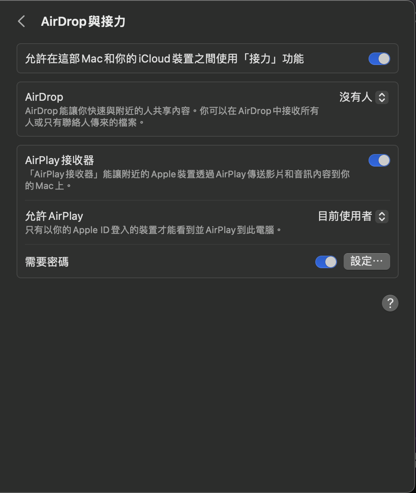
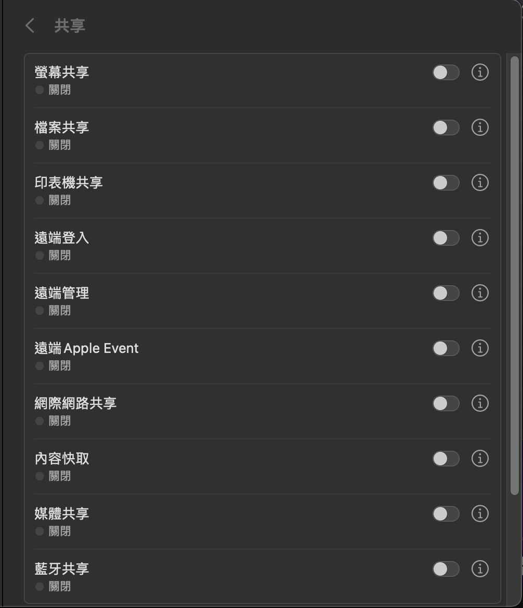
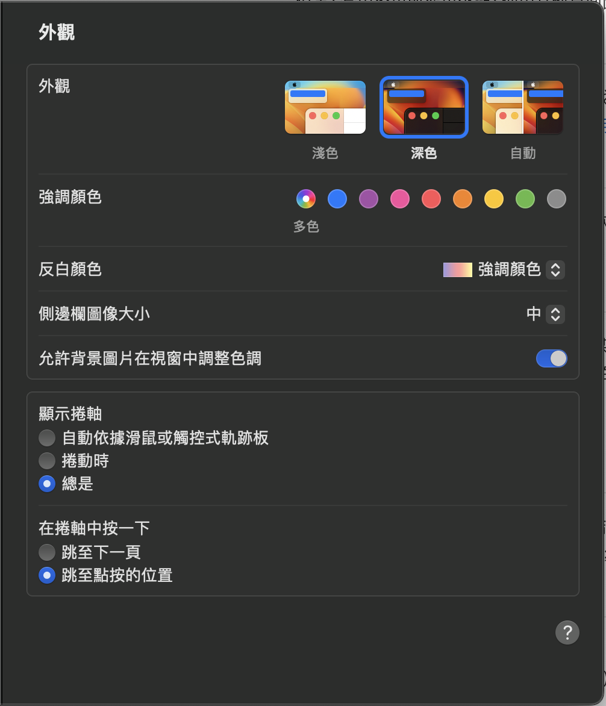
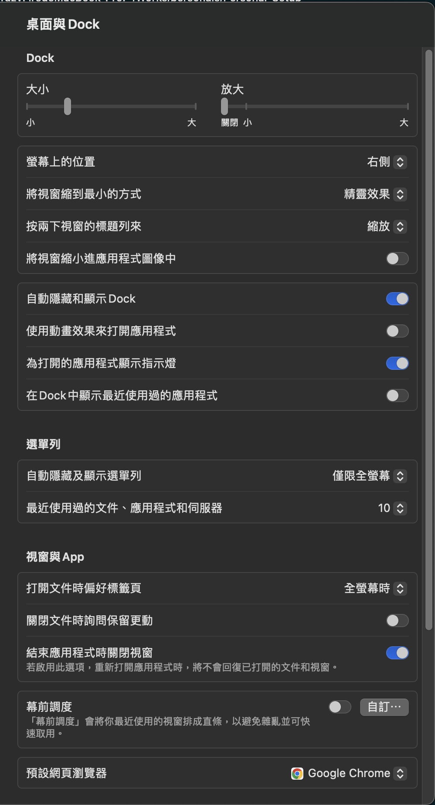
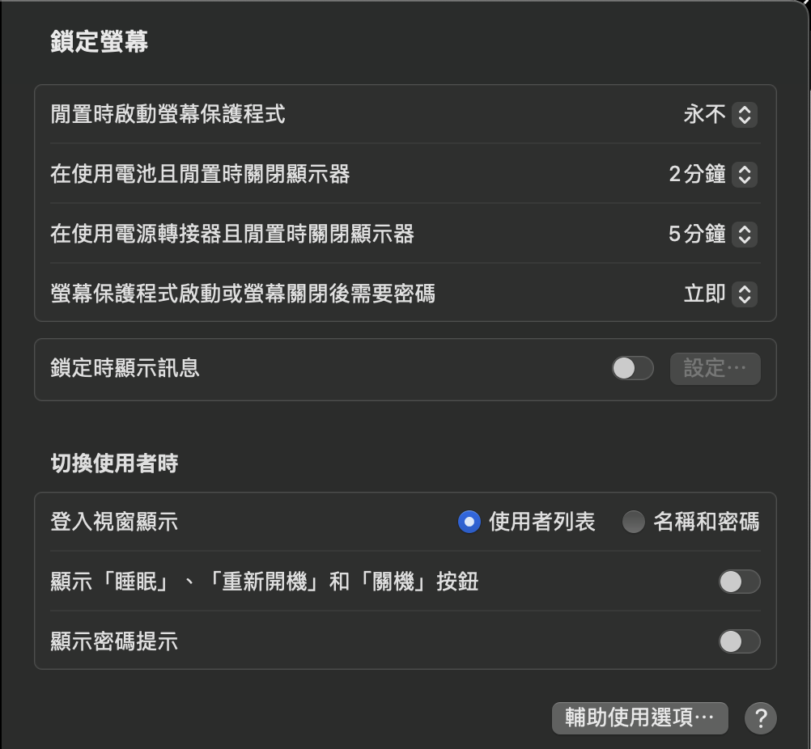

# Personal Mac OS Setup

## System Settings

### General

#### AirDrop and Handoff
> 

#### Sharing
> 

### Appearance
> 
* Important Settings:
  * appearance: `Dark`
  * sidebar icon size: `Medium`
  * allow wallpaper tinting: `Checked`
  * show scroll bars: `Always`
  * click in the scroll bar to: `Jump to the spot that's clicked`

### Accessibility
* Important Settings:
  * Zoom: Use scroll gesture with modifier keys to zoom: `Checked`, `Control`

### Desktop & Dock
> 
* Hot Corners:
  * Bottom left: `Send Display to Sleep`
  * Bottom right: `Default`

### Lock Screen
> 

## Terminal Settings

### brew
`/bin/bash -c "$(curl -fsSL https://raw.githubusercontent.com/Homebrew/install/HEAD/install.sh)"`

### Terminal
* `iterm2`
* `Hyper`: `brew install --cask hyper`
  * Solarized Dark Themes: `hyper i hyper-solarized-dark`

### Look
* Color: `Solarized Dark Higher Contrast`
* https://github.com/romkatv/powerlevel10k
* font setup the recommand of powerlevel10k

### ZSH shell + oh-my-zsh
* https://github.com/ohmyzsh/ohmyzsh
* https://github.com/zsh-users/zsh-syntax-highlighting
* https://github.com/zsh-users/zsh-autosuggestions

### Languages
* C/C++: xcode
* Java JDK: `adoptium`
* Python: 3.10 (2023/01/10 Pytorch is up to python 3.10)
* Golang: 19.4 (arm64)
* Conda:  (for Tensorflow and Pytorch now

## Applications

### Mac
* `iStat Menus`
* `Magnet` (need payed) / `Rectangle` (open source)
* `Spark`
* `Lima VM`

### Browser
* `Google Chrome`
* `Firefox`
* `Brave`

### Drive
* `Dropbox`
* `Google Drive`

### Coding
* `VScode`
* `Sublime`
* `Android Studio`
* `Bootstrap Studio`

#### API
* `Postman`

#### SQL
* `Navicat`

### Remote Desktop
* `Google Remote Desktop`
* `Parsec`

### Communication
* `Line`
* `Telegram`
* `Slack`
* `Discord`

### Mind Mapping
* `GitMind`
* `Whimsical`

### VPN
* `OpenVPN`
* `WireGuard`

### Project Management
* `Trello`
* `Asana`

### Notes
* `Obsidian`
* `Notion`
* `Hackmd` (Web)

## Virtual Machine
* `Lima`

## Container
* `Docker`

