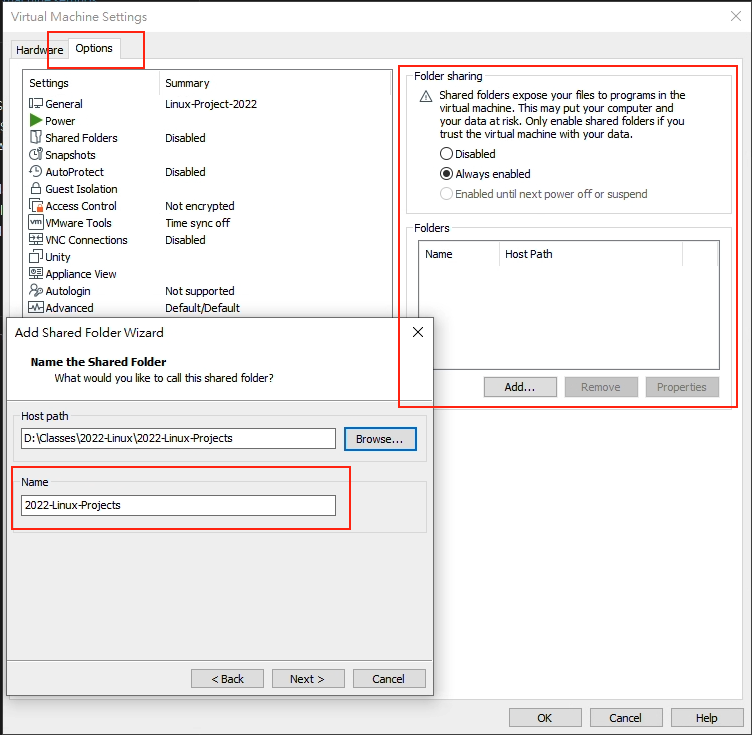

# VMware Notes

## Shared Folders

* 在 VM 的 Settings 裡面的 Options 可以看到 Shared Folders 這個選項，可以設定共享資料夾。
* 開啟 Always enabled 這個選項之後，下面可以添加想要共享的 Host (本地) 資料夾，裡面的 Name 是對應給 VM 的資料夾名稱。
    > 
* 在 VM 裡面，我們首先先建立一個用來映射的資料夾之後，可以手動 or 自動加載資料夾，
    * 手動加載資料夾：
        * `vmhgfs-fuse .host:/<filename> ./<file_path> -o allow_other`
    * 自動加載資料夾：`sudo vim /etc/fstab`，在最後面加上 `".host:/<filename> <vm_file_path> fuse.vmhgfs-fuse allow_other 0 0"`
